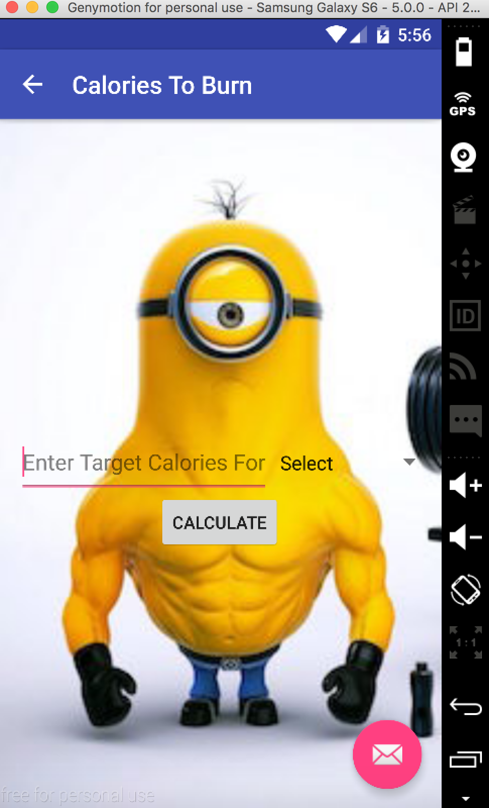

# PROG 01: Crunch Time

First mobile application made by Moonhyok Kim.

There could be major improvements, but the application provides crude estimation of 
calories burnt for a given exercise as well as amount of exercise needed to do to burn
up a specified calorie.

## Authors

Moonhyok Kim ([moonhyok@berkeley.edu](mailto:moonhyok@berkeley.edu))

## Demo Video

See [your demo video title here] (https://link_to_your_video)

## Screenshots

## Acknowledgments

Android Programming: The Big Nerd Ranch Guide
by Bill Phillips and Brian Hardy

* Hat tip to anyone who's code was used
* Any other support

*Feel free to enhance your README. For Markdown syntax, see [the GitHub Guides](https://guides.github.com/features/mastering-markdown/). Remove this line in your submission.*
